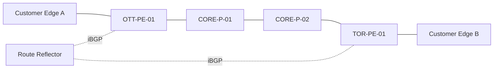

# Service Provider Lab

[](https://github.com/felipebarbosa4/service-provider-lab/actions/workflows/docs.yml)

Sanitized service-provider network labs covering BGP, MPLS L3VPN, EVPN, and Junos troubleshooting.

> All names, addresses, autonomous-system numbers, customer identifiers, and outputs are fictional. The configurations are educational examples, not production-ready templates.

## Goals

- Show how I design and document service-provider lab scenarios
- Connect topology, control-plane intent, configuration, verification, and failure analysis
- Demonstrate practical Junos and routing knowledge without exposing employer or customer data
- Keep each scenario reproducible and understandable by another engineer

## Lab topology



Full assumptions and addressing are documented in [diagrams/topology.md](diagrams/topology.md).

## Included scenarios

| Scenario | Focus | Key verification |
|---|---|---|
| [BGP underlay](labs/bgp/README.md) | eBGP/iBGP establishment and policy | Session state, received routes, next hop |
| [MPLS L3VPN](labs/mpls-l3vpn/README.md) | IGP, LDP, MP-BGP and VRF route exchange | Labels, VPN routes, end-to-end reachability |
| [EVPN](labs/evpn/README.md) | EVPN control plane and MAC/IP advertisement | EVPN routes, VNI state, MAC learning |
| [BGP session down](troubleshooting/bgp-session-down.md) | Structured fault isolation | TCP/179, AS mismatch, policy and reachability |

## Repository layout

```text
.
├── configs/
├── diagrams/
├── labs/
│   ├── bgp/
│   ├── evpn/
│   └── mpls-l3vpn/
├── scripts/
├── troubleshooting/
├── verification/
└── .github/workflows/
```

## How to use this repository

1. Read the topology and assumptions.
2. Choose a scenario and identify its success criteria.
3. Build the topology in an isolated lab such as EVE-NG.
4. Adapt the example configuration to the exact Junos release and virtual platform in use.
5. Validate each layer in order: interfaces, IGP, labels, BGP, service routes, then traffic.
6. Introduce one documented fault at a time and record the observed evidence.

## Safety and accuracy

Junos syntax and platform support can vary by release and hardware family. Verify commands against the official documentation for the exact release before applying them. See [SECURITY.md](SECURITY.md) for publication and sanitization rules.

## License

MIT. See [LICENSE](LICENSE).
