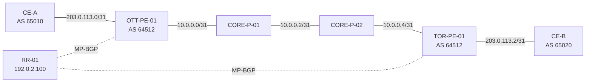

# Reference topology

This repository uses one fictional reference network so that the labs remain consistent.

## Node roles

| Node | Role | Loopback |
|---|---|---|
| OTT-PE-01 | Provider edge | 192.0.2.11/32 |
| CORE-P-01 | MPLS core | 192.0.2.31/32 |
| CORE-P-02 | MPLS core | 192.0.2.32/32 |
| TOR-PE-01 | Provider edge | 192.0.2.21/32 |
| RR-01 | Route reflector | 192.0.2.100/32 |
| CE-A | Customer edge | 198.51.100.10/32 |
| CE-B | Customer edge | 198.51.100.20/32 |

## Addressing policy

- `192.0.2.0/24`, `198.51.100.0/24`, and `203.0.113.0/24` are used as documentation ranges.
- `10.0.0.0/24` appears only as an isolated lab transit range.
- No address, hostname, circuit ID, or customer name comes from a real network.

## Control-plane assumptions

- IS-IS provides provider-core reachability.
- LDP distributes transport labels.
- PE routers exchange VPN routes through an MP-BGP route reflector.
- Customer routes are separated in a fictional VRF called `BLUE`.
- EVPN labs reuse the PE and RR nodes but are logically independent from the L3VPN scenario.

## Validation order

1. Physical and logical interfaces
2. IGP adjacencies and loopback reachability
3. MPLS/LDP sessions and label bindings
4. BGP sessions and address families
5. VRF or EVPN routes
6. Data-plane forwarding
