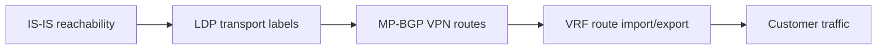

# Lab 2: MPLS L3VPN

## Objective

Provide isolated Layer 3 connectivity between two fictional customer sites across an MPLS core.

## Control-plane chain



A failure in an earlier layer can prevent later layers from working even when their configuration looks correct.

## Success criteria

- Provider loopbacks are reachable through the IGP.
- LDP sessions are operational across the core.
- PE routers have transport labels for remote PE loopbacks.
- MP-BGP VPN address-family sessions are established.
- The `BLUE` routing instance imports only the intended route target.
- CE-A and CE-B routes appear in the correct VRF.
- End-to-end traffic succeeds without leaking into other routing tables.

## Suggested verification

```text
show isis adjacency
show route protocol isis
show ldp session
show route table mpls.0
show bgp summary
show route table bgp.l3vpn.0
show route table BLUE.inet.0
show route forwarding-table table BLUE
```

## Failure injections

### Missing LDP on one core link

Expected symptom: IGP reachability remains, but the end-to-end label-switched path is incomplete.

### Route-target mismatch

Expected symptom: the VPN route may exist in `bgp.l3vpn.0` but not be imported into `BLUE.inet.0`.

### Missing VRF interface

Expected symptom: remote VPN routes may be present while the local CE subnet is absent or unreachable.

## Troubleshooting method

Work from the transport foundation upward:

1. Interface state and MTU
2. IGP adjacency and loopback route
3. LDP session and label binding
4. MP-BGP session and VPN route
5. Route-target import/export
6. VRF forwarding and CE reachability

Avoid changing multiple layers at once; preserve evidence from each step.
