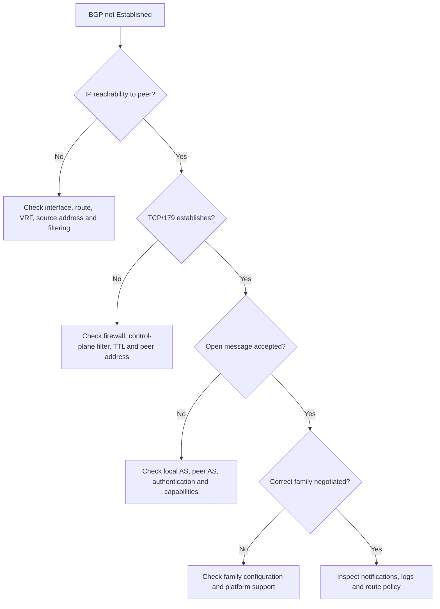

# Troubleshooting playbook: BGP session down

## Principle

Do not begin by changing policy. First determine whether the failure is transport, session negotiation, authentication, address-family activation, or routing policy.

## Decision flow



## Evidence checklist

1. Exact peer address and routing instance
2. Local source address used for the session
3. Route to the peer and return route to the source
4. TCP state and any reset reason
5. Local AS and configured peer AS
6. Authentication settings on both ends
7. Negotiated address families and capabilities
8. BGP notification code, subcode, and timestamp
9. Recent configuration changes

## Junos-oriented commands

```text
show bgp summary
show bgp neighbor <peer-address>
show route <peer-address> exact
show route forwarding-table destination <peer-address>
show interfaces terse
show log messages | match BGP
show log rpd | match <peer-address>
```

Use only commands supported by the exact Junos release and platform in the lab.

## Common patterns

### `Active`

Often indicates failure to complete the TCP connection, but the precise cause must be confirmed through reachability, filtering, source address, and logs.

### Repeated transition between `OpenSent` and `Idle`

Investigate AS mismatch, authentication mismatch, unsupported capabilities, or a received BGP notification.

### Session established but no routes

The session itself is healthy. Check address-family activation, import/export policy, route eligibility, next-hop resolution, and whether the peer has anything eligible to advertise.

## Closure criteria

- Root cause is supported by captured evidence.
- The smallest corrective change is identified.
- The expected state is documented before implementation.
- Post-change verification confirms both session state and route behaviour.
- A rollback action is available.
